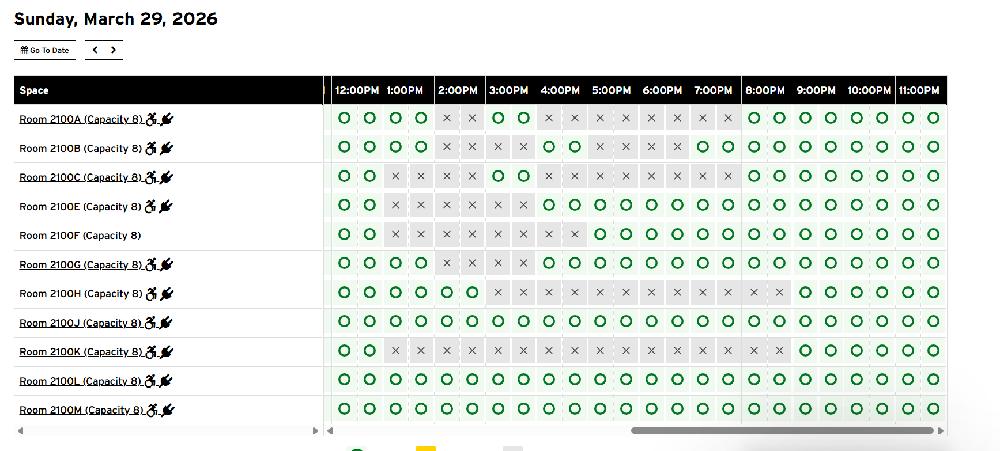

# UMDRoomReserve

Outdated due to a UI change

A Python-based Selenium utility designed to streamline and automate the room reservation process for the McKeldin Library at the University of Maryland. It handles the tedious "30-minute block" selection process and coordinates multiple user accounts for long-duration bookings.

Key Features:
* Desirability-Based Search: Automatically scans for availability based on a pre-defined ranking (starting with Room 2100K, then G, M, A, etc.). It finds the first room that can accommodate the entire requested time block.
* Multi-Session Orchestration: Rotates through a local list of user credentials to book consecutive 2-hour sessions, effectively bypassing individual booking limits for long study marathons.
* Automated Date Navigation: Programmatically interacts with the LibCal "Next Day" controls and handles "limit warning" popups to find your target date.
* String Normalization: Handles the specific formatting required by the UMD LibCal system, including removing leading zeros from time and date strings to match the site's XPATH attributes.

Future updates:
* More detailed scheduling options
* Automatic scheduling
* GUI
